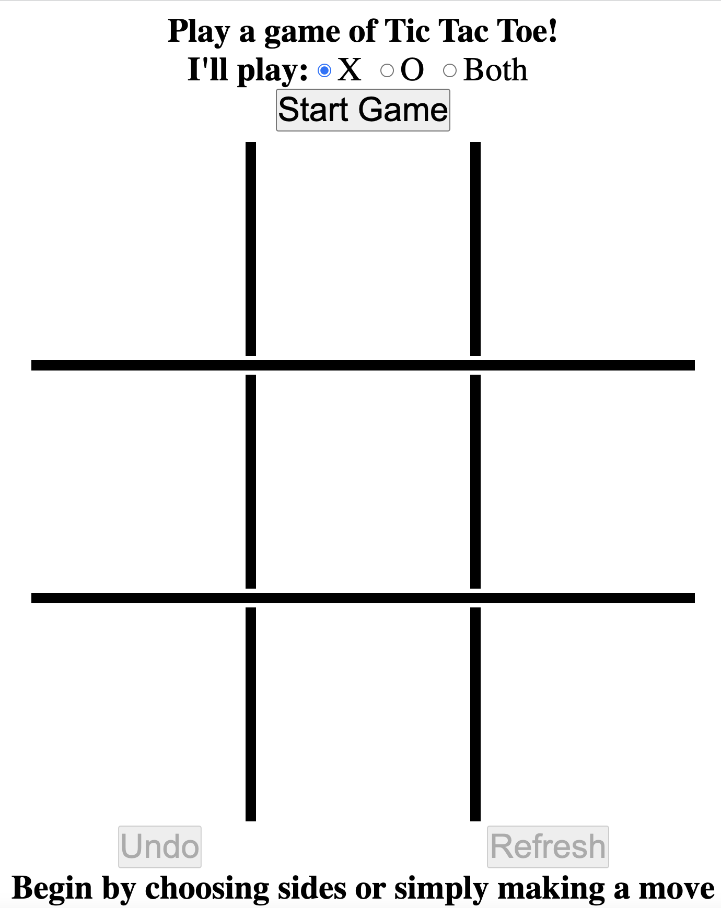

# TicTacToe
The game of Tic Tac Toe, created primarily to practice Javascript

## User Story

```
AS AN internet user
I WANT to play Tic Tac Toe
SO THAT I can relax
```
## Acceptance Criteria

Here are the critical requirements for this game:

```
GIVEN I need to play Tic Tac Toe
WHEN I load their game
THEN I am presented a blank game board and game start options to play X, O or Both
WHEN I click start game
THEN the game starts using the specified options
WHEN I click the board without clicking start game
THEN the game starts with my playing X and the computer playing O
WHEN the computer plays a move
THEN it should always be one of the available best moves
WHEN I examine the code
THEN I will see a brute force search rather than anything like if X plays in corner then O plays in center
WHEN the game has started
THEN I can UNDO moves or REFRESH/RESTART the game
```
## Application Preview



## Application Link

Here is the URL to the actual website:

https://rhoverholt.github.io/TicTacToe/
